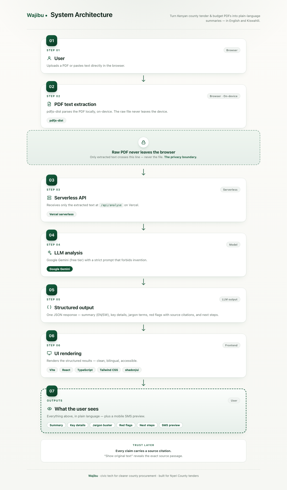

# Wajibu

**Making Nyeri County tenders and budgets understandable to everyone.**

Wajibu is a civic-tech proof of concept that turns dense Kenyan county tender notices and budget documents into plain Swahili and English so residents, small suppliers, and local journalists can understand, question, and act on public spending.

> *Wajibu* (Swahili): responsibility, duty.

**Live app:** [wajibu.vercel.app](https://wajibu-five.vercel.app/)

---

## Submission Materials

Built for the **Andela × Open Society Foundations** civic tech invention sprint (September 2026).

- 🌐 **Live app:** [wajibu.vercel.app](https://wajibu-five.vercel.app/)
- 📹 **Demo video:** [Watch on YouTube](https://youtu.be/...) *(link to be added)*
- 📊 **Pitch deck:** [View slides](https://docs.google.com/presentation/...) · [Outline in PITCH-DECK.md](./PITCH-DECK.md)
- 📝 **Written summary:** [SUMMARY.md](./SUMMARY.md)
- 🎬 **Demo script:** [DEMO-SCRIPT.md](./DEMO-SCRIPT.md)

**Track:** Transparency & Accountability (cross-track: Stability & Social Cohesion)

---

## The Problem

Public tender notices and county budget documents in Kenya are technically public, but practically unreadable. They are written in dense legal and procurement English, with deadlines and eligibility rules buried deep in PDFs. Most affected residents, including the small suppliers and youth who could bid, cannot decode them.

The result:

- Communities are sidelined from opportunities meant for them
- Tender participation stays concentrated among a few well-connected firms
- Citizens cannot meaningfully question public spending

This is not just a comprehension gap. It is exclusion by design.

---

## The Solution

Wajibu takes a real Nyeri County tender or budget PDF and produces:

1. **A plain-language summary** in English or Swahili
2. **Key details extracted** — tender number, deadline, eligibility, value, contact
3. **A jargon buster** — tap any technical term for a plain explanation
4. **Red flags** — unusual deadlines, sole-source language, restrictive eligibility — each with a source citation
5. **Clear next steps** — who to ask, who to report to, where to learn more

Every claim links back to the source document. Nothing is invented.

---

## How It Works

```
PDF upload → text extraction (pdfjs-dist) → /api/analyse → Gemini → structured JSON → UI
```

- **Frontend:** Vite + React + TypeScript
- **UI:** Tailwind CSS + shadcn/ui, with light/dark mode
- **PDF extraction:** pdfjs-dist (browser-side, no upload of the raw PDF)
- **LLM:** Google Gemini (free tier) via Vercel serverless function
- **Deploy:** Vercel

The LLM prompt explicitly forbids invention: if something is not in the document, the model says *"Not stated in this document."* Every summary and red flag carries a source citation.

---

## Architecture



*The browser extracts text locally — only extracted text is sent to the serverless API — and Gemini returns a cited analysis that the frontend renders as a summary, key details, jargon buster, red flags, next steps, and an SMS preview.*

## What You Can Do in the App

- **Analyse a document** — upload a PDF or paste text
- **Read a plain-language summary** — EN or SW, one tap to switch
- **See key details** — tender number, deadline, eligibility, value, contact
- **Decode jargon** — tap any technical term for a plain explanation
- **Review red flags** — each with the exact source quote
- **Verify the source** — "Show original text" reveals the passage each claim came from
- **Enlarge the text** — standard / large / extra-large, without browser zoom
- **Get an SMS summary** — a mock SMS conversation
- **Read clear next steps** — who to ask, who to report to, where to learn more

---

## Real-World Design Choices

| Constraint | How Wajibu meets it |
|---|---|
| **Trust & verification** | Every summary and red flag carries a source citation. "Show original text" reveals the passage it was based on. The prompt forbids invention. |
| **Low bandwidth** | Documents are parsed locally and analyses are cached on-device, revisiting the same PDF loads instantly with no extra request. The service worker keeps the app shell offline-capable, and the SMS preview gives feature-phone users a ≤160-character summary.|
| **Accessibility** | WCAG-aware semantics, skip-to-content link, three text sizes, keyboard-navigable, high contrast in both themes. |
| **Privacy** | No login to read. No tracking. Uploaded PDFs are parsed in the browser — only extracted text reaches the server. Queries are not tied to identity. |
| **Multilingual access** | Swahili + English today. Kikuyu on the roadmap. |
| **Local relevance** | Real Nyeri County documents. Named oversight bodies: Nyeri County Assembly, PPRA, EACC. |
| **Clear next steps** | Every result ends with named actions: ask your MCA, report to PPRA or EACC, contact the procurement office. |

---

## Running Locally

```bash
git clone https://github.com/nazarenegena/wajibu.git
cd wajibu
npm install
echo "GEMINI_API_KEY=your_key_here" > .env
npx vercel dev          # terminal 1 — runs the serverless function on :3000
npm run dev             # terminal 2 — runs the Vite frontend on :5173
```

Open http://localhost:5173

**Requirements:**

- Node.js 18+
- A free Gemini API key from [aistudio.google.com/apikey](https://aistudio.google.com/apikey)
- Vercel CLI (`npm i -g vercel`) for local serverless functions

---

## Sample Documents

Real Nyeri County documents used in the demo are in `public/samples/` — all three are tenders:

- **NYEWASCO Supply of Water Meters** ([PDF](public/samples/Nyewasco-supply-of-Water-meters.pdf)) — a Nyeri Water & Sewerage Company tender for the supply of water meters
- **Nyeri County Sports Facilities Tender** ([PDF](public/samples/Nyeri-Sports-Tender.pdf)) — for the construction or upgrading of sports facilities
- **Nyeri Youth Group Tender** ([PDF](public/samples/Nyeri-Youth-Tender.pdf)) — with eligibility reserved for youth groups

All are publicly available. Wajibu does not host or redistribute anything that is not already public.

---

## What This Is Not

This is an **invention sprint proof of concept**, not a production product.

- It is not affiliated with, endorsed by, or connected to Nyeri County Government.
- It does not accuse anyone of wrongdoing. It surfaces information so citizens can question it responsibly.
- It does not give legal advice. Users are directed to named oversight bodies for formal action.

---

## Originality

Wajibu comes from lived experience. Growing up in Nyeri County, the author saw firsthand how county tender notices and budget documents — though publicly available — remained unreadable to the very people they were meant to serve: small suppliers, youth, and ordinary residents. That observation, not an AI tool, is the origin of the project's problem framing and design.

AI development tools (Google Gemini for summarisation, AI coding assistants for development) supported the build only, as permitted by the hackathon rules. The core concept is the author's own.

---

## Roadmap

- [ ] Multiple language support
- [ ] Direct integration with `tenders.go.ke` and county websites
- [ ] Community verification layer (citizens flag and confirm summaries)
- [ ] Pilot with one county assembly
- [ ] In-app document-grounded assistant for follow-up questions

---

## License

MIT

---

Built for the **Andela × Open Society Foundations** civic tech invention sprint, September 2026.
